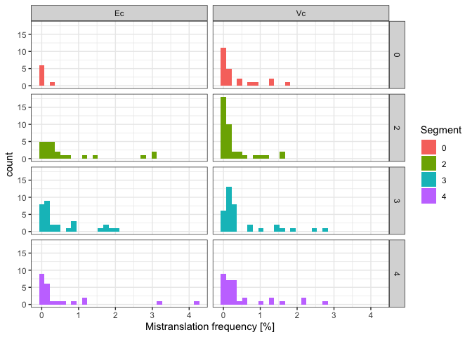
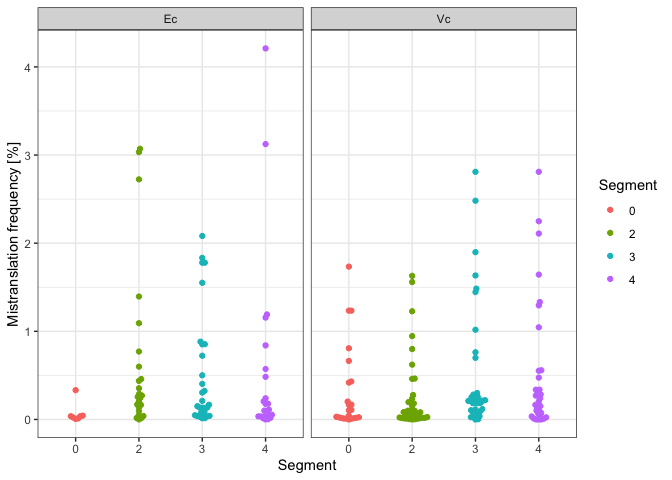
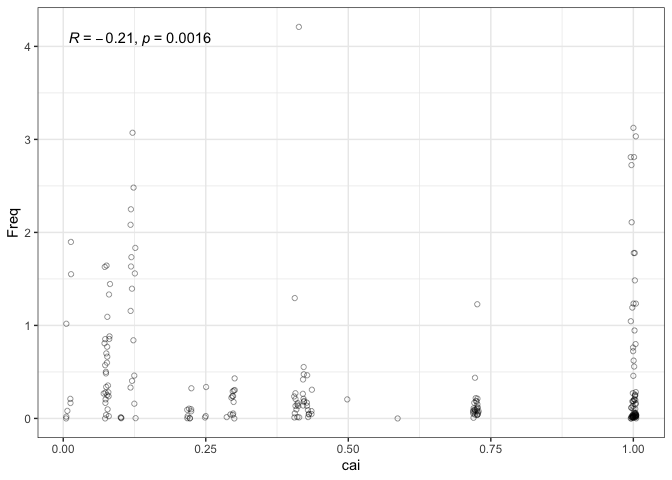
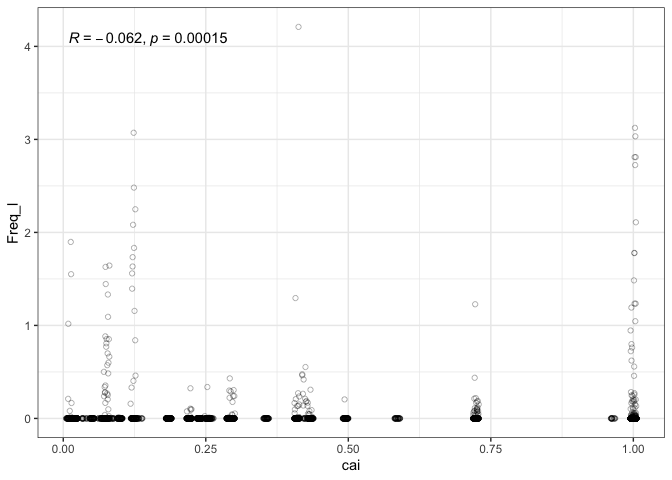
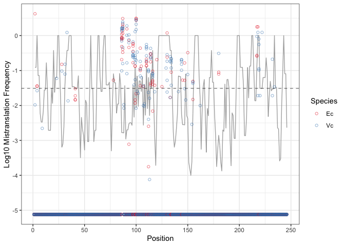
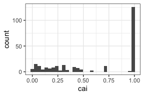
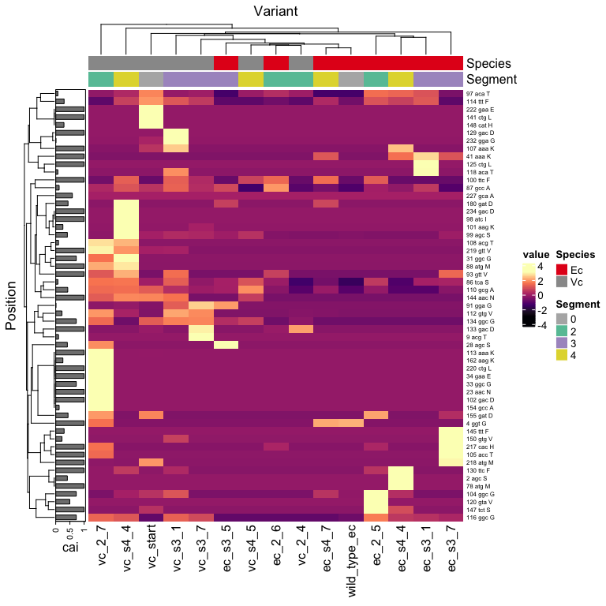
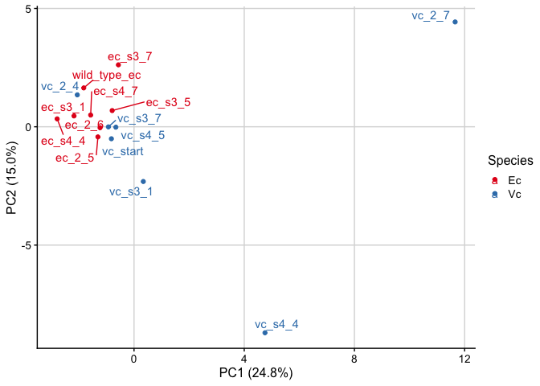
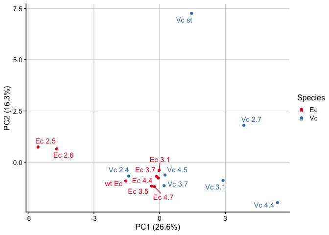
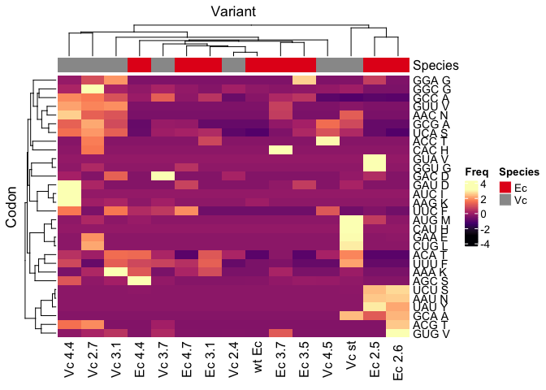

Mistranslation analysis
================
Sinisa Bratulic
11 August, 2021

# Setup

## Load the CAI data

Load E. coli codon adaptation index table - data is from the *seqinr*
package, cited below, originally published in: Sharp, P.M., Li, W.-H.
(1987) Nucleic Acids Research, 15:1281-1295.

``` r
data(caitab) 
caitab <- caitab %>% rownames_to_column(var = "Codon")
caitab <- caitab %>% select(Codon, cai = ec) 
knitr::kable(list(caitab[1:16,],
           caitab[17:32,],
           caitab[33:48,],
           caitab[49:64,]),
           booktabs = TRUE, valign = 't')
```

<table class="kable_wrapper">
<tbody>
<tr>
<td>

| Codon |   cai |
|:------|------:|
| aaa   | 1.000 |
| aac   | 1.000 |
| aag   | 0.253 |
| aat   | 0.051 |
| aca   | 0.076 |
| acc   | 1.000 |
| acg   | 0.099 |
| act   | 0.965 |
| aga   | 0.004 |
| agc   | 0.410 |
| agg   | 0.002 |
| agt   | 0.085 |
| ata   | 0.003 |
| atc   | 1.000 |
| atg   | 1.000 |
| att   | 0.185 |

</td>
<td>

|     | Codon |   cai |
|:----|:------|------:|
| 17  | caa   | 0.124 |
| 18  | cac   | 1.000 |
| 19  | cag   | 1.000 |
| 20  | cat   | 0.291 |
| 21  | cca   | 0.135 |
| 22  | ccc   | 0.012 |
| 23  | ccg   | 1.000 |
| 24  | cct   | 0.070 |
| 25  | cga   | 0.004 |
| 26  | cgc   | 0.356 |
| 27  | cgg   | 0.004 |
| 28  | cgt   | 1.000 |
| 29  | cta   | 0.007 |
| 30  | ctc   | 0.037 |
| 31  | ctg   | 1.000 |
| 32  | ctt   | 0.042 |

</td>
<td>

|     | Codon |   cai |
|:----|:------|------:|
| 33  | gaa   | 1.000 |
| 34  | gac   | 1.000 |
| 35  | gag   | 0.259 |
| 36  | gat   | 0.434 |
| 37  | gca   | 0.586 |
| 38  | gcc   | 0.122 |
| 39  | gcg   | 0.424 |
| 40  | gct   | 1.000 |
| 41  | gga   | 0.010 |
| 42  | ggc   | 0.724 |
| 43  | ggg   | 0.019 |
| 44  | ggt   | 1.000 |
| 45  | gta   | 0.495 |
| 46  | gtc   | 0.066 |
| 47  | gtg   | 0.221 |
| 48  | gtt   | 1.000 |

</td>
<td>

|     | Codon |   cai |
|:----|:------|------:|
| 49  | taa   | 0.000 |
| 50  | tac   | 1.000 |
| 51  | tag   | 0.000 |
| 52  | tat   | 0.239 |
| 53  | tca   | 0.077 |
| 54  | tcc   | 0.744 |
| 55  | tcg   | 0.017 |
| 56  | tct   | 1.000 |
| 57  | tga   | 0.000 |
| 58  | tgc   | 1.000 |
| 59  | tgg   | 1.000 |
| 60  | tgt   | 0.500 |
| 61  | tta   | 0.020 |
| 62  | ttc   | 1.000 |
| 63  | ttg   | 0.020 |
| 64  | ttt   | 0.296 |

</td>
</tr>
</tbody>
</table>

``` r
citation("seqinr")
```

    ## 
    ## To cite seqinr in publications use:
    ## 
    ##   Charif, D. and Lobry, J.R. (2007)
    ## 
    ## A BibTeX entry for LaTeX users is
    ## 
    ##   @InCollection{,
    ##     author = {D. Charif and J.R. Lobry},
    ##     title = {Seqin{R} 1.0-2: a contributed package to the {R} project for statistical computing devoted to biological sequences retrieval and analysis.},
    ##     booktitle = {Structural approaches to sequence evolution: Molecules, networks, populations},
    ##     year = {2007},
    ##     editor = {U. Bastolla and M. Porto and H.E. Roman and M. Vendruscolo},
    ##     series = {Biological and Medical Physics, Biomedical Engineering},
    ##     pages = {207-232},
    ##     address = {New York},
    ##     publisher = {Springer Verlag},
    ##     note = {{ISBN :} 978-3-540-35305-8},
    ##   }

## Load and process sfGFP sequence

``` r
gfp_n <- seqinr::read.fasta(file = "data/sfGFPn.fasta")
df_seq <- data.frame(Codon = splitseq(gfp_n$sfGFP)) %>% 
  left_join(caitab %>% select(Codon, cai)) %>%
  mutate(cai_roll = zoo::rollmean(cai, k = 3, fill = NA))
df_seq$Codon_c <- lapply(df_seq$Codon, s2c)
df_seq$AA <- sapply(df_seq$Codon_c, translate)
df_seq <-df_seq %>% rowid_to_column(var = "Position") %>% 
  group_by(Codon) %>% mutate(nGFP = n()) %>% ungroup()
```

## Show CAI

Rolling mean calculated over a window of 3 codons. Rolling mean is shown
as a line, and CAI as colors.

``` r
df_seq %>% 
  mutate(Codon = str_to_upper(Codon),
         #Position = paste(Position, Codon, AA)
         ) %>%
  ggplot(aes(x = Position, fill = cai)) +
  geom_rect(ymin=0, ymax=1, aes(xmin = Position -0.5, xmax = Position + 0.5), alpha = 0.4) +
  geom_line(aes(y = cai_roll))+
  theme_bw()+
  scale_fill_distiller(palette = "PuOr")+
  scale_x_continuous(breaks = seq(0,250,20))+
  #theme(axis.text.x = element_text(hjust = 1, vjust = 1)) +
  ylab("Rolling mean")
```

<!-- -->

## Load and process manuscript data 1

``` r
filepos <- "data/Sub_AA_sfGFP_SuppFig6DE.xlsx"
sheets_pos <- excel_sheets(filepos)
df_pos <- lapply(sheets_pos,function(x) read_xlsx(filepos, sheet=x)) %>%
  bind_cols() %>% 
  clean_names() %>%
  select(-sf_gfp_amino_acid_residue_n_c_10)
```

    ## New names:
    ## * `sfGFP amino acid residue N-C` -> `sfGFP amino acid residue N-C...1`
    ## * `sfGFP amino acid residue N-C` -> `sfGFP amino acid residue N-C...10`

``` r
colnames(df_pos)[1] <- "Position"

head(df_pos)
```

    ## # A tibble: 6 x 16
    ##   Position wild_type_ec ec_2_5 ec_2_6 ec_s3_1 ec_s3_5 ec_s3_7 ec_s4_4 ec_s4_7
    ##      <dbl>        <dbl>  <dbl>  <dbl>   <dbl>   <dbl>   <dbl>   <dbl>   <dbl>
    ## 1        1      NA          NA     NA      NA      NA      NA   NA    NA     
    ## 2        2      NA          NA     NA      NA      NA      NA    4.21 NA     
    ## 3        3      NA          NA     NA      NA      NA      NA   NA    NA     
    ## 4        4       0.0364     NA     NA      NA      NA      NA   NA     0.0353
    ## 5        5      NA          NA     NA      NA      NA      NA   NA    NA     
    ## 6        6      NA          NA     NA      NA      NA      NA   NA    NA     
    ## # … with 7 more variables: vc_start <dbl>, vc_2_4 <dbl>, vc_2_7 <dbl>,
    ## #   vc_s3_1 <dbl>, vc_s3_7 <dbl>, vc_s4_4 <dbl>, vc_s4_5 <dbl>

``` r
df_pos_l <- df_pos %>%
  select(-contains("residue")) %>%
  pivot_longer(cols = -Position,
               names_to = "Variant",
               values_to = "Freq") %>%
  mutate(Species = if_else(str_detect(Variant, "ec"), "Ec", "Vc"),
         Evolved = if_else(str_detect(Variant, "wild|start"), FALSE, TRUE),
         Segment = if_else(!Evolved, 
                           "0", 
                           str_replace(Variant, "^.._s*(\\d)_.*","\\1")),
         Variant = factor(Variant)
  ) %>% distinct() %>%
  left_join(df_seq %>% select(Position, Codon, AA, cai, cai_roll, nGFP)) 
```

    ## Joining, by = "Position"

``` r
  #mutate(Freq_i = if_else(is.na(Freq), 0, Freq))
df_pos_l %>% distinct(Variant, Species, Evolved, Segment)
```

    ## # A tibble: 15 x 4
    ##    Variant      Species Evolved Segment
    ##    <fct>        <chr>   <lgl>   <chr>  
    ##  1 wild_type_ec Ec      FALSE   0      
    ##  2 ec_2_5       Ec      TRUE    2      
    ##  3 ec_2_6       Ec      TRUE    2      
    ##  4 ec_s3_1      Ec      TRUE    3      
    ##  5 ec_s3_5      Ec      TRUE    3      
    ##  6 ec_s3_7      Ec      TRUE    3      
    ##  7 ec_s4_4      Ec      TRUE    4      
    ##  8 ec_s4_7      Ec      TRUE    4      
    ##  9 vc_start     Vc      FALSE   0      
    ## 10 vc_2_4       Vc      TRUE    2      
    ## 11 vc_2_7       Vc      TRUE    2      
    ## 12 vc_s3_1      Vc      TRUE    3      
    ## 13 vc_s3_7      Vc      TRUE    3      
    ## 14 vc_s4_4      Vc      TRUE    4      
    ## 15 vc_s4_5      Vc      TRUE    4

# Exploratory analysis

## Aggregate plots

-   make histograms and beeswarm plots - only show measured frequencies

``` r
df_pos_l %>%
  ggplot(aes(x = Freq, fill = Segment)) +
  geom_histogram(bins = 30, position = "dodge")+
  facet_grid(Segment~Species) + theme_bw() +
  xlab("Mistranslation frequency [%]") +
  ggsave(device = "svg", filename = "Figs/fig1.svg")
```

    ## Saving 7 x 5 in image

<!-- -->

``` r
df_pos_l %>%
  ggplot(aes(x = Segment, y = Freq, color = Segment)) +
  ggbeeswarm::geom_beeswarm()+ 
  facet_wrap(~Species) +
  theme_bw()+
  ylab("Mistranslation frequency [%]") +
  ggsave(device = "svg", filename = "Figs/fig2.svg")
```

    ## Saving 7 x 5 in image

<!-- -->

## Mistranslation profile vs the CAI

-   only show measured rates

Calculate Spearman rank correlation for mistranslation frequency vs CAI

``` r
library(ggpubr)
df_pos_l %>% 
  ggplot(aes(x = cai, y = Freq)) +
  geom_jitter(alpha = 0.4, width = 0.005, shape = 21) + 
  stat_cor(method = "spearman")+
  theme_bw() +
  ggsave(device = "svg", filename = "Figs/fig3.svg")
```

    ## Saving 7 x 5 in image

<!-- -->

Weak to no correlation.

## Mistranslation profile vs the CAI (with imputed unobserved mistranslation freqs)

What if we consider positions where no mistranslation was observed?

E.g. impute missing values based on LOD.

LOD estimated as 1/10 of the lowest observed mistranslation frequency

``` r
(LOD <- df_pos_l %>% filter(Freq >0) %>% pull(Freq) %>% min/10)
```

    ## [1] 7.5911e-06

Unobserved mistranslation frequencies set to LOD/10

``` r
df_pos_l <- df_pos_l %>% mutate(Freq_l = if_else(is.na(Freq) | Freq == 0, LOD, Freq))
head(df_pos_l)
```

    ## # A tibble: 6 x 12
    ##   Position Variant       Freq Species Evolved Segment Codon AA      cai cai_roll
    ##      <dbl> <fct>        <dbl> <chr>   <lgl>   <chr>   <chr> <chr> <dbl>    <dbl>
    ## 1        1 wild_type_ec    NA Ec      FALSE   0       atg   M         1       NA
    ## 2        1 ec_2_5          NA Ec      TRUE    2       atg   M         1       NA
    ## 3        1 ec_2_6          NA Ec      TRUE    2       atg   M         1       NA
    ## 4        1 ec_s3_1         NA Ec      TRUE    3       atg   M         1       NA
    ## 5        1 ec_s3_5         NA Ec      TRUE    3       atg   M         1       NA
    ## 6        1 ec_s3_7         NA Ec      TRUE    3       atg   M         1       NA
    ## # … with 2 more variables: nGFP <int>, Freq_l <dbl>

Calculate Spearman rank correlation for mistranslation frequency vs CAI

``` r
df_pos_l %>% 
  ggplot(aes(x = cai, y = Freq_l)) +
  geom_jitter(alpha = 0.3, width = 0.005, shape = 21) + 
  stat_cor(method = "spearman")+
  theme_bw()+
  ggsave(device = "svg", filename = "Figs/fig4.svg")
```

    ## Saving 7 x 5 in image

<!-- -->

## Show rolling CAI vs mistranslation frequencies

Rolling mean of CAI rescaled to (-4,0) range for plotting.

``` r
df_pos_l %>% 
  mutate(cai_roll = scales::rescale(cai_roll, to = c(-4,0))) %>%
  ggplot(aes(x = Position, y = log10(Freq_l), color = Species)) +
  geom_line(aes(y = cai_roll),color = "grey60", alpha = 0.8) + 
  geom_hline(yintercept = median(scales::rescale(df_seq$cai_roll, to = c(-4,0)), na.rm = T), 
             linetype = "dashed", alpha = 0.5) + 
    geom_point(shape = 21, alpha = 0.5) + 
  theme_bw() +
  scale_color_brewer(palette = "Set1") +
  ylab("Log10 Mistranslation Frequency") +
  ggsave(device = "svg", filename = "Figs/fig6.svg")
```

    ## Saving 7 x 5 in image

<!-- -->

Overall, these CAI vs mistranslation correlation estimates are highly
biased. sfGFP sequence is codon optimized and on average has a high CAI:

``` r
df_pos_l %>% 
  distinct(Position, cai) %>%
  ggplot(aes(x = cai)) +
  geom_histogram() +
  theme_bw()+
  ggsave(device = "svg", filename = "Figs/fig5.svg")
```

<!-- -->

## Hierachical clustering based on observed mistranslated position/rate

``` r
library(tidyHeatmap)
```

    ## ========================================
    ## tidyHeatmap version 1.2.2
    ## If you use tidyHeatmap in published research, please cite:
    ## 1) Mangiola et al. tidyHeatmap: an R package for modular heatmap production 
    ##   based on tidy principles. JOSS 2020.
    ## 2) Gu, Z. Complex heatmaps reveal patterns and correlations in multidimensional 
    ##   genomic data. Bioinformatics 2016.
    ## This message can be suppressed by:
    ##   suppressPackageStartupMessages(library(tidyHeatmap))
    ## ========================================

    ## 
    ## Attaching package: 'tidyHeatmap'

    ## The following object is masked from 'package:stats':
    ## 
    ##     heatmap

``` r
df_h <- df_pos_l %>% filter(!is.na(Freq)) %>% 
  select(Position, Variant, Freq) %>%
  pivot_wider(names_from = "Variant", values_from = "Freq") %>%
  pivot_longer(cols = -c(Position),
               names_to = "Variant") %>%
  mutate(value =if_else(is.na(value), 0, value)) %>%
  left_join(df_pos_l %>% select(-Freq) %>% distinct())
```

    ## Joining, by = c("Position", "Variant")

``` r
svg("Figs/fig7.svg")
fig7<-df_h %>% mutate(Position = paste(Position, Codon, AA)) %>%
  tidyHeatmap::heatmap(.row = Position,
                     .column = Variant,
                     .value = value,
                     #transform = log10,
                     palette_value = circlize::colorRamp2(c(-3, -1.5, 0, 1.5, 3), viridis::magma(5))
) %>%
  add_tile(Species) %>%
  add_tile(Segment) %>%
  add_bar(cai)
fig7
dev.off()
```

    ## quartz_off_screen 
    ##                 2

``` r
fig7
```

<!-- -->

## PCA based on observed mistranslated position/frequency

``` r
library(FactoMineR)
library(broom)
df_t <- df_h %>% 
  filter(Position != 227) %>%
  select(Position, Variant, value) %>%
  pivot_wider(names_from = "Position", values_from = "value") %>%
  left_join(df_h %>% distinct(Variant, Species, Evolved, Segment))
```

    ## Joining, by = "Variant"

``` r
pca_fit <- df_t %>% 
  select(where(is.numeric)) %>%
  scale() %>%
  prcomp()
sp<-summary(pca_fit)
pca_fit %>%
  augment(df_t) %>% # add original dataset back in
  ggplot(aes(.fittedPC1, .fittedPC2, color = Species)) + 
  geom_point(size = 1.5) +
  cowplot::theme_half_open(12) + cowplot::background_grid() +
  ggrepel::geom_text_repel(aes(label = Variant),  max.overlaps =20)+
  scale_color_brewer(palette = "Set1") +
  xlab(sprintf("PC1 (%2.1f%%)",sp$importance[2,1:2][[1]]*100)) +
  ylab(sprintf("PC2 (%2.1f%%)",sp$importance[2,1:2][[2]]*100)) +
  ggsave(device = "svg", filename = "Figs/fig8.svg")
```

    ## Saving 7 x 5 in image

<!-- -->

## Which positions contribute the most to the separation

``` r
library(factoextra)
```

    ## Welcome! Want to learn more? See two factoextra-related books at https://goo.gl/ve3WBa

``` r
var_pca <- get_pca(pca_fit)
message("Top 5 positions contributing to PC1:")
```

    ## Top 5 positions contributing to PC1:

``` r
sort(var_pca$contrib[,1], decreasing = T)[1:5]
```

    ##      219      108       23       34      162 
    ## 7.012910 6.569677 5.807112 5.807112 5.807112

``` r
message("Top 5 positions contributing to PC2:")
```

    ## Top 5 positions contributing to PC2:

``` r
sort(var_pca$contrib[,2], decreasing = T)[1:5]
```

    ##       99      101       98      234      180 
    ## 9.137233 8.854173 8.808433 8.808433 7.708417

# Mistranslation profile analysis

## Load the data

``` r
filemt <- "data/Sub_AA_sfGFP_SuppFig6F.xlsx"
mt_sheets <- excel_sheets(filemt)
l_mt <- lapply(mt_sheets, function(x) read_xlsx(filemt, sheet=x))
names(l_mt) <- mt_sheets
df_mt <- bind_rows(l_mt, .id = "ID") %>%
  mutate(Codon = if_else(is.na(Codon), `Codon (down)`, Codon)) %>%
  select(-contains("misin"),-contains("down")) %>%
  mutate(Variant = str_remove_all(ID, "Supp Fig.. "))

df_mt_l <- df_mt %>% select(-ID) %>%
  pivot_longer(cols = -c(Variant, Codon), 
               names_to = "AA_mis",
               values_to = "Freq")
```

## PCA analysis of mistranslation profile

Sum of mistranslation rates for each codon into an aggregate
‘mistranslation profile’.

Decompose the profile by PCA.

``` r
df_t_mt <- df_mt_l %>% 
  filter(!is.na(Freq)) %>% 
  group_by(Codon, Variant) %>% summarise(sumF = sum(Freq), .groups = "drop") %>% 
  left_join(df_seq %>% distinct(Codon, AA) %>% mutate(Codon = str_to_upper(str_replace_all(Codon, "t","u")))) %>%
  mutate(Codon = paste(Codon, AA)) %>%
  select(-AA) %>%
  pivot_wider(names_from = "Codon", values_from = "sumF", values_fill = 0) %>%
  mutate(Species = if_else(str_detect(Variant, "Ec"), "Ec", "Vc"))
```

    ## Joining, by = "Codon"

``` r
pca_fitmt <- df_t_mt %>% 
  select(where(is.numeric)) %>%
  scale() %>%
  prcomp()
sp2<-summary(pca_fitmt)
pca_fitmt  %>%
  augment(df_t_mt) %>% # add original dataset back in
  ggplot(aes(.fittedPC1, .fittedPC2, color = Species)) + 
  geom_point(size = 1.5) +
  cowplot::theme_half_open(12) + cowplot::background_grid() +
  ggrepel::geom_text_repel(aes(label = Variant), max.overlaps =20, force = 15) +
  scale_color_brewer(palette = "Set1")+
  xlab(sprintf("PC1 (%2.1f%%)",sp2$importance[2,1:2][[1]]*100)) +
  ylab(sprintf("PC2 (%2.1f%%)",sp2$importance[2,1:2][[2]]*100)) + 
  ggsave(device = "svg", filename = "Figs/fig9.svg")
```

    ## Saving 7 x 5 in image

<!-- -->

## Which codons contribute the most to separation of mistranslation profiles?

``` r
var_pca_mt <- get_pca(pca_fitmt)
message("Top 5 Codons contributing to PC1:")
```

    ## Top 5 Codons contributing to PC1:

``` r
sort(var_pca_mt$contrib[,1], decreasing = T)[1:5]
```

    ##    UCA S    AAC N    GCG A    GUU V    GCC A 
    ## 8.762929 7.570374 7.340184 7.035592 6.830776

``` r
message("Top 5 Codons contributing to PC2:")
```

    ## Top 5 Codons contributing to PC2:

``` r
sort(var_pca_mt$contrib[,2], decreasing = T)[1:5]
```

    ##    AUG M    GAA E    CAU H    CUG L    GCA A 
    ## 18.38136 17.05235 16.80963 16.09647 11.17627

## Clustering based on mistranslation profile

``` r
svg("Figs/fig10.svg")
fig10 <- df_t_mt %>%
  pivot_longer(cols = -c(Variant, Species), names_to = "Codon", values_to = "Freq") %>%
  tidyHeatmap::heatmap(.row = Codon,
                     .column = Variant,
                     .value = Freq,
                     #transform = log10,
                     palette_value = circlize::colorRamp2(c(-3, -1.5, 0, 1.5, 3), viridis::magma(5))
) %>%
  add_tile(Species)
fig10
dev.off()
```

    ## quartz_off_screen 
    ##                 2

``` r
fig10
```

<!-- -->
